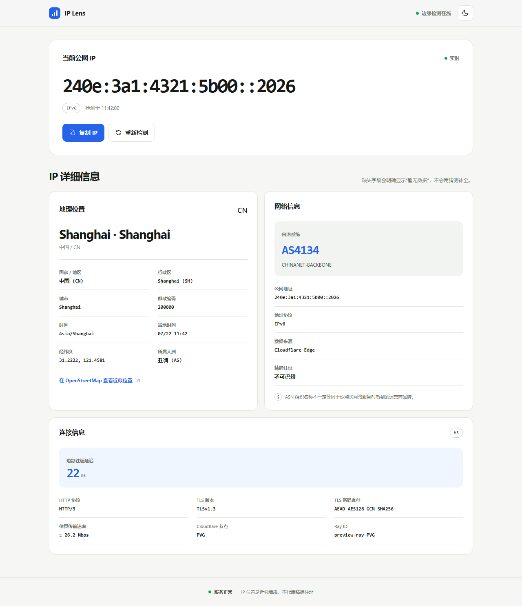
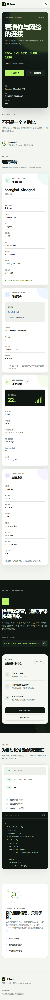

# IP Lens

一个面向个人自托管的 IP 检测网站：运行在 Cloudflare Workers，无数据库、无第三方 IP 查询服务、无需 API Key。网页、详细 JSON API 和苹果快捷指令接口一次部署全部可用。

[](https://deploy.workers.cloudflare.com/?url=https://github.com/HereNoAg300L/ip-checker)

> 点击上方按钮即可从 `HereNoAg300L/ip-checker` 部署。如果你将项目复制到自己的仓库，请把按钮链接替换为新的公开仓库 URL。



<details>
<summary>查看移动端长页面预览</summary>


</details>

## 功能

- 自动识别公网 IPv4 / IPv6，并规范化 IPv4-mapped IPv6。
- 首页只呈现当前 IP、地理归属、网络身份和连接质量。
- 显示国家、地区、城市、邮编、时区、经纬度和当地时间。
- 显示 ASN、网络组织、HTTP / TLS 协议、边缘延迟、Cloudflare 节点和 Ray ID。
- 提供详细 JSON、中文纯文本和仅 IP 三类稳定接口。
- 适配 iPhone、iPad 和 Mac 的“快捷指令”。
- 响应禁止共享缓存，不回显 Cookie、Authorization 或任意转发头。
- 自动深浅色、键盘焦点、加载状态、移动端单列和减少动态效果。

所有 IP 地理信息都来自当前请求的 Cloudflare `request.cf` 元数据。位置是网络数据库的近似结果，不代表精确住址；ASN 组织名也不一定等同于运营商品牌。

## 一键部署

### Cloudflare Deploy 按钮

1. 将 `ip-checker` 目录作为公开仓库推送到 GitHub。
2. 修改 README 顶部 Deploy 按钮的仓库 URL（如果仓库不是 `HereNoAg300L/ip-checker`）。
3. 点击 **Deploy to Cloudflare**。
4. 登录 Cloudflare，确认仓库名和 Worker 名，随后部署。

Cloudflare 会克隆仓库、配置 Workers Builds 并执行 `npx wrangler deploy`。本项目不依赖 KV、D1、R2 或 Secret，首次部署无需填写额外配置。

### 命令行部署

需要 Node.js 22 或更高版本：

```bash
corepack enable
pnpm install
pnpm deploy
```

首次执行时 Wrangler 会引导登录 Cloudflare。部署完成后会得到一个 `*.workers.dev` 地址，也可在 Cloudflare 控制台绑定自己的域名。

### 本地开发

```bash
corepack enable
pnpm install
pnpm dev
```

Cloudflare 的 `request.cf` 在 Dashboard / Playground 预览中可能不可用。若只想查看带模拟数据的完整界面：

```bash
pnpm preview:mock
```

然后访问 `http://127.0.0.1:8787`。

## API

所有访客信息响应都带有 `Cache-Control: private, no-store`。字段缺失时返回 `null`，不会省略字段或猜测结果。

| 接口 | 返回 | 用途 |
| --- | --- | --- |
| `GET /api/v1/ip` | JSON | 完整 IP、位置、网络与连接信息 |
| `GET /api/v1/ip?format=text` | `text/plain` | 排版好的中文摘要，适合快捷指令直接显示 |
| `GET /api/v1/ip?format=plain` | `text/plain` | 仅当前 IP |
| `GET /ip` | `text/plain` | 仅当前 IP 的短路径 |
| `GET /api/v1/ip.txt` | `text/plain` | 仅当前 IP，兼容 `.txt` 调用习惯 |
| `GET /healthz` | JSON | 最小健康检查，不返回访客信息 |

### JSON 示例

```json
{
  "schemaVersion": 1,
  "ok": true,
  "available": true,
  "ip": "203.0.113.42",
  "version": 4,
  "network": {
    "asn": 4134,
    "asnLabel": "AS4134",
    "organization": "CHINANET-BACKBONE"
  },
  "location": {
    "country": "CN",
    "countryName": "中国",
    "region": "Shanghai",
    "regionCode": "SH",
    "city": "Shanghai",
    "postalCode": "200000",
    "continent": "AS",
    "continentName": "亚洲",
    "timezone": "Asia/Shanghai",
    "latitude": 31.22222,
    "longitude": 121.45806,
    "isEU": false
  },
  "connection": {
    "httpProtocol": "HTTP/3",
    "tlsVersion": "TLSv1.3",
    "tlsCipher": "AEAD-AES128-GCM-SHA256",
    "tcpRttMs": null,
    "quicRttMs": 22,
    "deliveryRateBps": 3280000
  },
  "edge": {
    "colo": "PVG",
    "rayId": "example-PVG"
  },
  "request": {
    "method": "GET",
    "scheme": "https"
  },
  "privacy": {
    "stored": false,
    "preciseLocation": false,
    "note": "IP 地理位置为网络数据库的近似结果，不代表精确住址。"
  },
  "source": ["cloudflare-edge"],
  "timestamp": "2026-07-22T12:00:00.000Z"
}
```

## 苹果快捷指令

[下载并安装「查我的 IP」快捷指令](shortcuts/IP-Lens.shortcut?raw=1)

1. 先完成 Cloudflare 部署，并复制部署结果中以 `workers.dev` 结尾的网站首页地址。
2. 在 iPhone、iPad 或 Mac 上点击上方链接，下载后用“快捷指令”打开。
3. 添加快捷指令时，粘贴网站首页地址；不要填写 `/api` 路径。
4. 首次运行时允许它访问该网站。

快捷指令会自动清理地址、请求 `/api/v1/ip?format=text`，并显示完整中文 IP 信息。它不需要 API Key，不读取通讯录、照片、定位或剪贴板；开启 VPN、iCloud 专用代理或切换蜂窝网络后，结果可能变化。

可安装文件由开源 [Cherri](https://github.com/electrikmilk/cherri) 生成，并在制作阶段通过 RoutineHub HubSign 签名；日常查询只连接你自己的 Worker，不经过签名服务。[查看可审计源码](shortcuts/IP-Lens.cherri)或[手动创建与高级用法](docs/apple-shortcuts.md)。

如果下载文件无法打开，可按照说明中的三步手动创建，功能完全相同。

## 隐私与安全边界

- 只读取 Cloudflare 提供的 `CF-Connecting-IP`，不会信任 `X-Forwarded-For`、`Forwarded` 或 `X-Real-IP`。
- 不返回 Cookie、Authorization、Referer、完整 User-Agent 或其他任意请求头。
- 不使用第三方 Geo API，因此不会把访客 IP 再发送给其他服务。
- API 默认不允许浏览器跨域读取；苹果快捷指令和命令行请求不受浏览器 CORS 限制。
- 所有访客响应禁止缓存，避免不同访客之间串号。
- 该 IP 结果仅用于展示，不能作为登录、授权、风控或计费依据。
- 项目代码不主动记录访问日志；Cloudflare 账户级别的标准分析和日志策略由部署者自行管理。

如果 Cloudflare Zone 开启了 **Pseudo IPv4**，建议选择 `Off` 或 `Add Header`，避免用伪 IPv4 覆盖真实 IPv6。

## 为什么没有“VPN / 代理 / Tor 风险分数”？

Cloudflare 基础请求元数据不能可靠给出这些结论。为了避免误导和避免把访客 IP 发送给第三方，本项目不会用启发式规则伪造风险判断。需要此类能力时，应由部署者明确接入可信数据源、配置 Worker Secret，并向访客说明数据会发送给谁。

## 项目结构

```text
ip-checker/
├─ public/                 # 静态网页与 PWA 资源
├─ src/index.js            # Worker 路由、API 与安全响应头
├─ test/                   # Node 单元测试与模拟预览服务
├─ docs/apple-shortcuts.md # 快捷指令说明
├─ shortcuts/              # 已签名快捷指令与可审计源码
├─ wrangler.jsonc          # Cloudflare Workers 配置
└─ package.json
```

## 测试

```bash
pnpm check
pnpm test
```

测试覆盖 IPv4 / IPv6 规范化、伪造转发头、敏感头泄漏、输出格式、HEAD / OPTIONS / 405、无共享缓存和快捷指令文本返回。

## 参考

- [Cloudflare Deploy to Cloudflare buttons](https://developers.cloudflare.com/workers/platform/deploy-buttons/)
- [Cloudflare Request / `request.cf`](https://developers.cloudflare.com/workers/runtime-apis/request/#incomingrequestcfproperties)
- [Cloudflare Workers Static Assets](https://developers.cloudflare.com/workers/static-assets/)
- [Apple：在“快捷指令”中提出第一个 API 请求](https://support.apple.com/zh-cn/guide/shortcuts/apd58d46713f/ios)
- [Apple：在 iPhone 或 iPad 上共享快捷指令](https://support.apple.com/zh-cn/guide/shortcuts/apdf01f8c054/ios)

## License

[MIT](LICENSE)
